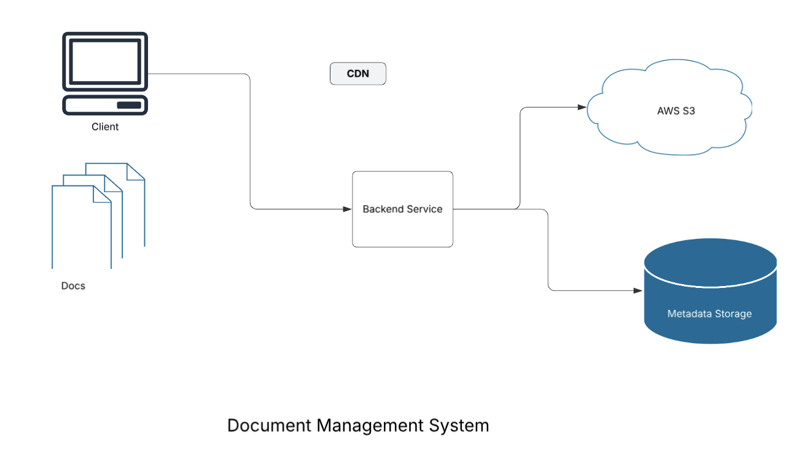

### PDF Management System
## Overview
This project is a PDF Management System that allows users to:

Upload PDFs via a web interface.
View uploaded PDFs in a list.
Preview the first page of a PDF as a JPEG.
Apply a stamp (date, name, comment) at the bottom of a PDF.
Download and delete PDFs, including any applied stamps.
The backend is developed using Spring Boot, and the frontend is built with React.js.

## Project Structure



## Backend (Spring Boot)

```
backend/
│── src/
│   ├── main/java/com/ecmind/document/management/
│   │   ├── controller/
│   │   │   ├── PdfController.java
│   │   ├── service/
│   │   │   ├── PdfStorageService.java
│   │   │   ├── PdfRenderingService.java
│   │   │   ├── PdfStampService.java
│   │   ├── model/
│   │   │   ├── PdfMetadata.java
│   │   │   ├── StampData.java
│   │   ├── repository/
│   │   │   ├──PdfRepository.java
│   │   ├── exception/
│   │   │   ├─PdfNotFoundException.java      
│   │   ├── ManagementApplication.java
│   ├── resources/
│   │   ├── application.properties
│── target/
│── pom.xml
```

## Frontend (React)
```

frontend/
│── src/
│   ├── components/
│   │   ├── PdfUploader.js
│   │   ├── PdfList.js
│   │   ├── PdfManager.js
│   ├── api/
│   │   ├── api.js
│   ├── App.js
│   ├── index.js
│── public/
│── package.json
│── README.md
```

## Backend - API Endpoints

| Method  | Endpoint                | Description                              |
|---------|--------------------------|------------------------------------------|
| **POST**   | `/api/pdfs/upload`      | Upload a new PDF file                   |
| **GET**    | `/api/pdfs`             | List all uploaded PDFs                  |
| **GET**    | `/api/pdfs/{id}/preview`| Get a JPEG rendition of the first page  |
| **POST**   | `/api/pdfs/{id}/stamp`  | Apply a stamp to the PDF                |
| **GET**    | `/api/pdfs/{id}/download` | Download the stamped PDF               |
| **DELETE** | `/api/pdfs/{id}`        | Delete a PDF                            |

## Frontend - Features
* PDF Upload: Users can upload a new PDF file.
* List PDFs: Displays a list of uploaded PDFs.
* Preview PDF: Clicking on a PDF shows its first page as an image.
* Apply Stamp: Users can add a stamp (date, name, comment) and apply it to the document.
* Download/Delete PDFs: Users can download the stamped PDF or delete it.


### Setup & Installation
#### Backend (Spring Boot)
1. Navigate to the backend directory:

   ```
   cd backend

   ```

2. Build and run the application:

```
mvn clean install
mvn spring-boot:run
```
3. The backend will be available at http://localhost:8080.


## Frontend (React.js)

1. Navigate to the frontend directory:
```
cd frontend

```

2. Install dependencies:
```
npm install
```

3. Start the development server:
```
npm start
```
4. The frontend will be available at http://localhost:3000.


## Technologies Used
### Backend
* Java 17
* Spring Boot
* Spring Web
* Spring Data JPA
* PDFBox
* Maven

### Frontend
* React.js
* Axios (for API requests)
* React Router (for navigation)

### Database
* MongoDB (or use H2 for testing)
* AWS S3 (for cloud-based file storage, optional)

## Improvements & Future Enhancements
* Implement user authentication (JWT-based login).
* Use CDN caching for faster previews.
* Store PDFs in AWS S3 Storage.
* Add support for annotations and watermarking.


